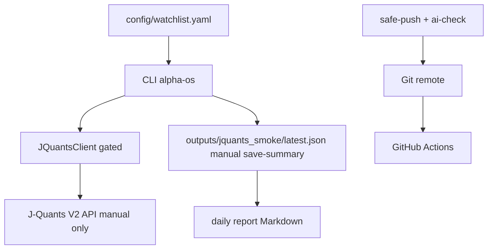

# invest-alpha-os System Overview for External Review

This single document summarizes **purpose**, **architecture**, **safety model**, **current progress**, and **open risks**. It is meant to be pasted or attached wholesale for reviewers (for example Claude Code, security review, or external audit).

---

## 1. Project Purpose

- Personal **investment judgment support OS**: structure evidence, configs, CLI workflows, and **daily reports** in one repo.
- **Observation Only + Shadow Portfolio**: the system observes and records hypotheses; **no brokerage execution**.
- **No Auto Trading**: no order placement paths; veto and risk scaffolding exist for future phases only.
- **Human has final discretion**: tooling outputs are advisory drafts; configs and thresholds remain human-controlled.

---

## 2. Current Phase

- **Phase 0** (v1.1 skeleton): **completed** — package layout, core models, stubs, Makefile `verify`, GitHub Actions, documentation baseline.
- **Phase 1a** (J-Quants foundation): **in progress** — `JQuantsClient` over **HTTP** with strict gates; **`debug`** commands for previews and bounded live probes; **`alpha-os daily`** embeds watchlist summaries and readiness without calling J-Quants in CI or default daily paths.
- **J-Quants V2 data foundation**: **API key via `x-api-key`** header; **legacy V1 Bearer** discouraged and isolated.
- **safe-push automation**: gated `git add`/`commit`/`push` (`scripts/safe_commit_push.sh`) with forbidden-path checks and Codex JSON gate (`make ai-check` → `codex-review`).
- **daily report readiness**: **J-Quants readiness** tier (Green / Yellow / Red) from **dry-run / config-derived signals only** unless a maintainer attaches a prior **local smoke summary JSON** (`outputs/jquants_smoke/latest.json`). **Live HTTP remains off** inside `daily`, `make verify`, and Actions.

Green in the UI of a developer machine may reflect historic local summaries; CI does not imply a live quota call succeeded that day.

---

## 3. Architecture Overview

| Area | Responsibility |
|------|----------------|
| **CLI** (`alpha-os`) | Thin Typer façade: observe, snapshots, **`daily`** report, **`pack`**, **`risks`**, **`debug`** probes (watchlist batches, previews, guarded live HTTP). |
| **config/** | YAML: watchlists (`watchlist.yaml`), market adapters (`market_data.yaml` including J-Quants report knobs), veto rules, confidence, weights. |
| **data adapters** | `MarketDataAdapter` surface; **`JQuantsStubAdapter`**, **`JQuantsClient`** (live paths gated), yfinance/edinet stubs. |
| **reports** | `reports/jquants_watchlist_daily.py` renders Markdown sections embedded by **`daily`**: watchlist bars check, readiness, **optional local smoke summary reader** (`latest.json`). |
| **reporting helpers** | `reporting/jquants_smoke_summary.py` sanitizes summaries written under `outputs/jquants_smoke/` (**no secrets; no raw body** policy). |
| **tests/** | pytest: client normalization, CLI contracts, readiness without HTTP, Codex-independent checks. |
| **docs/** | Phase plans (`08`), manual J-Quants playbook (`09`), AI workflow (`07`), dev status (`01`), **this overview (`10`).** |
| **outputs/** | Locally generated Markdown, sanitized smoke JSON (**gitignored**, except scaffold files like `.gitkeep` / README). |
| **GitHub Actions** | `tests` workflow + ancillary jobs; **`make test`** / **`make verify`** only (no outbound J-Quants in CI defaults). |
| **safe-push** | Pre/post forbidden-path scans, **`make ai-check`**, deterministic Codex **`latest.json`** decision gate before push. |

Diagram notes: **`D`** is reached only via explicit human gates (`--live`, env flags, `.env`). **`E`** is populated by **`debug jquants-watchlist-bars ... --save-summary`** and is **ignored by Git**. **`F`** reading **`latest.json`** is **fs + JSON parse only**.

---

## 4. Safety & Governance Model

- **Secrets hygiene**: `.env`, tokens, PEMs, **`outputs/` real data**, and `.ai/reviews/*` reviewer artifacts stay **outside Git**.
- **J-Quants live HTTP gates** (collectively): **`JQUANTS_ENABLED`**, CLI **`--live`**, **`JQUANTS_ALLOW_LIVE_HTTP=true`**, plus **configured base URL and API key**. Missing prerequisites produce **`live_blocked` / `not_configured`**; **no retries with secrets echoed**.
- **Display policy**: **`x-api-key` values**, Bearer tokens, and **raw vendor JSON bodies** do **not** appear in sanitized summaries or mandated daily sections — only boolean flags (`raw_response_included`), counts, statuses, capped previews on HTTP errors (**masked/truncated**).
- **`daily` during automation**: **`make verify` / Actions** intentionally **omit live network** paths; readability of Green/Yellow derives from deterministic dry-run bookkeeping and optionally **saved local sanitized JSON**.
- **`make safe-push`**: forbids accidental staging of env/credentials/`outputs`; requires Codex **`decision`** acceptable or human override **`ALLOW_IMPORTANT=true`** semantics per existing rules (never weakening `skipped`/`failed`).
- **`ops-check` wrappers** (`env-doctor`, `daily-check`, `post-push-check`): summarize env **presence**, print **Markdown excerpts** plus **cheap leak heuristics**, and **`gh`** Actions surface **metadata only**.

---

## 5. Implemented Feature Highlights

- **`debug jquants-watchlist-bars`** — sequential watchlist probing (dry-run default; `--preview-request` without HTTP). **`--save-summary`** persists JSON **without secrets**.
- **`debug jquants-daily-quotes`** — single-symbol diagnostics aligned with **`YYYYMMDD`** outbound dates.
- **Contract-window guardrails** (`JQUANTS_DATA_AVAILABLE_FROM`/`TO`): reject out-of-contract CLI dates **before HTTP**.
- **`alpha-os daily`** — embeds **`## J-Quants Watchlist Bars Check`** and readiness; merges **Latest local smoke summary** when **`include_latest_smoke_summary`** is true **and path exists**, with **blocked** UX on unsafe payloads.
- **Makefile shortcuts** — **`env-doctor`**, **`daily-check`**, **`jquants-smoke-dry-run`**, guarded **`jquants-smoke-live`**, **`post-push-check`**, chained **`ops-check`**.

---

## 6. Progress Snapshot

| Milestone | State |
|-----------|-------|
| GitHub Actions green | ✅ typical |
| `safe-push` + Codex gate | ✅ |
| J-Quants **V2** live smoke (**human machine**) | ✅ record exists in playbook |
| **`watchlist limit 3` live** + **`--save-summary`** | ✅ documented |
| sanitized **`outputs/jquants_smoke/`** persistence | ✅ |
| **daily readiness Green** eligibility (config-dependent) | ✅ without CI live |
| **Task 11** refinement (readiness granularity via history) | ⏳ **not merged** |

---

## 7. Known / Residual Risks

- **`jquants-smoke-live` Make target** trusts the human invoking **`CONFIRM_LIVE_HTTP=YES`** side-by-side with valid `.env` — misuse still performs network I/O (**by design**, dev-only shortcut).
- **Local `latest.json` integrity**: **tampered summaries** presenting unexpected shapes may still be suppressed by blocklist logic, yet **supply-chain / disk tampering remains a local trust assumption** reviewers should note.
- **Rate limits / ToS drift** upstream are **not programmatically modeled** beyond minimal HTTP error previews.
- **Forward-looking scaffold** (`signals`, veto engines, tiers) carries **engineering debt** vs production broker adapters — reviewers should distinguish **intent** from readiness for capital deployment.
- **`gh`** metadata in **`post-push-check`** simplifies triage yet **still depends on local auth/state** (`gh login`) when used.

---

## 8. Suggested Questions for External Reviewers

1. Are **gates + documentation** adequate to prevent accidental **`--live`** in CI / automated agents?
2. Is the **dual surface** (**dry telemetry vs optional JSON snapshot**) coherent for compliance narratives?
3. Should **artifact signing / checksum** of `latest.json` be warranted for archival audit trails?

---

_Last updated aligned with Phase 1a DevOps tooling + external review briefing task._
