# US provider scheduled ingest — safety design (**Main R6.0–R6.4** anchors)

## 1. Purpose

This document is the **safety contract and readiness gate** for evolving US provider tooling (today: **Stooq preview path**) from **manual, operator-triggered** previews (**Main R5**) toward **scheduled / unattended ingest** in a **future** programme (**Main R6+**).

**Main R6.0 scope:**

- **Design / policy / documentation** captured in this file — no cron, no GitHub Actions **`schedule`**, no production refresh loops.

**Main R6.1 adds (implemented):**

- **`us_provider_scheduled_ingest_plan.py`**: **`build_us_provider_scheduled_ingest_plan`**, **`merged_symbols_for_scheduled_ingest_plan`**, **`render_us_provider_scheduled_ingest_plan_markdown`**.
- **CLI** **`debug us-provider-scheduled-ingest-plan`** (**`--markdown`** optional): prints **JSON** (canonical) or Markdown **plan recap** — **no vendor HTTP**, **no cache write**, **never** prints API key **values** (**`STOOQ_APIKEY`** name may appear as metadata only).

**Still out of scope (R6.1):**

- Cron, Actions schedule, unattended multi-symbol GETs, batch cache writers.

**Out of scope legacy R6.0-only note:**

- Changing JP pipelines, US daily Markdown defaults, or single-symbol gated tooling behaviour (**unchanged**).

**Main R6.4.0 adds (implemented — preflight readiness only):**

- **`--preflight`** flag on **`debug us-provider-manual-live-batch-smoke`**: validates gates + **`--max-http`**; emits **`manual_live_batch_smoke_preflight_ready`** (exit 0) or **`validation_error`** (exit 2) — **still zero vendor HTTP** — see **`docs/14`** R6.4.0 section.

**Main R6.3 adds (implemented — scaffold only):**

- **`us_provider_manual_live_batch_smoke.py`**: **`build_us_provider_manual_live_batch_smoke_payload`**, **`render_manual_live_batch_smoke_markdown`**.
- **CLI** **`debug us-provider-manual-live-batch-smoke`**: merges symbols, applies **`limit`** / **`--max-http`**, emits **`manual_live_batch_smoke_dry_run`** or scaffold **`validation_error`** — **`--live`** is **accepted** but **always refuses** vendor HTTP (**real execution is Main R6.4.1+**). **`make us-provider-manual-live-batch-smoke-dry-run`** is an optional Makefile shortcut (**still no HTTP**, **`--live`/`--write-cache` not used**).

**Main R6.2 remains (documentation):**

- **[`docs/14_us_provider_manual_live_batch_smoke_design.md`](14_us_provider_manual_live_batch_smoke_design.md)**: operator-approved **manual live batch smoke** proposal — bounded **`max_http`**, dual gates (**`CONFIRM_US_LIVE_HTTP`** + **`CONFIRM_US_MANUAL_BATCH_SMOKE`**), **no** scheduler, **no** default cache write, **still not** unattended scheduled ingest (**R6.4+**).

**Canonical neighbours:**

- Provider plan / phased history: **`docs/11_us_market_data_provider_plan.md`**
- Failure matrix / operator playbook: **`docs/12_us_provider_failure_operator_playbook.md`**
- Manual live batch smoke (**R6.2 design anchor**): **`docs/14_us_provider_manual_live_batch_smoke_design.md`**

---

## 2. Current baseline (implemented before R6)

As of **Main R5.3.1**, the repo already provides:

| Capability | Notes |
|------------|--------|
| **Single-symbol gated cache write** | **`debug us-provider-cache-preview`** with **`CONFIRM_US_CACHE_WRITE=YES`** + **`--write-cache`** + **`--live`** path per **`docs/11` / `docs/12`**. |
| **Multi-symbol batch preview** | **`run_stooq_cache_preview_batch`** / **`debug us-provider-cache-preview-batch`** — JSON **`results[]`**, **`summary`**, **`operator_summary`**; **batch cache write deliberately unsupported**. |
| **Copy-ready Markdown recap** | **`--markdown`** output (**counts only**); **JSON remains canonical** for row-level fields. |
| **No unattended live HTTP** | Default dry-run; **`CONFIRM_US_LIVE_HTTP=YES`** required for gated GETs; **no CI/live loops** per playbook. |
| **Stooq posture** | **Preview / prototype** tier — not assumed broker-grade production entitlement. |
| **US daily section** | **Disabled by default** (`include_us_momentum_cache_only_section` unchanged). |
| **Secrets / outputs hygiene** | **`STOOQ_APIKEY`** env-only when used; **safe-push** guards against accidental **`outputs/`** / `.env` commits; **no raw vendor payloads** in tooling outputs. |
| **R6.1 dry-run plan renderer** | **`debug us-provider-scheduled-ingest-plan`** (**`--from-watchlist`** / **`--symbols`**, **`--limit`**) emits **`scheduled_plan_dry_run`** JSON (`plan_rows`, `gate_status`, optional env caps) — **observation only**. |
| **R6.3 manual batch smoke scaffold** | **`debug us-provider-manual-live-batch-smoke`** — **`manual_live_batch_smoke_dry_run`** or scaffold **`validation_error`**; **`--live`** **never** performs vendor GETs (**R6.4.1+**); optional **`make us-provider-manual-live-batch-smoke-dry-run`**. |
| **R6.4.0 preflight readiness** | **`--preflight`** on same CLI — **`manual_live_batch_smoke_preflight_ready`** or **`validation_error`**; **zero vendor HTTP**; validates gates + **`--max-http`**. |

---

## 3. Target future state (phased — **not** committed delivery dates)

Phases describe **intent**. **R6.0**, **R6.1 (plan renderer)**, **R6.2 (`docs/14`, design)**, and **R6.3 (manual batch scaffold)** are reflected in-repo **as documented**; **R6.4+** (**real bounded live HTTP**, then gated write exploration, then scheduled ingest) remain **future**.

| Phase | Intent |
|-------|--------|
| **R6.0** | **Safety design** — this document’s contract; **no scheduler execution**. |
| **R6.1** | **Dry-run plan renderer** (**implemented**) — JSON / Markdown plans; **no HTTP**, **no cache write** (`src/.../us_provider_scheduled_ingest_plan.py`). |
| **R6.2** | **`docs/14`** manual live batch smoke — **policy / CLI shape / gates** (**design-first** milestone). |
| **R6.3** | **Manual live batch scaffold** (**implemented**) — **`debug us-provider-manual-live-batch-smoke`** merges symbols / reports caps; **`--live`** **does not perform** vendor GETs; **exit 2** scaffold reasons (**`manual_batch_smoke_*`**) per **`docs/14`** / **`docs/12`**. |
| **R6.4.0** | **Preflight readiness check** (**implemented**) — **`--preflight`** validates gates + **`--max-http`**; **`manual_live_batch_smoke_preflight_ready`** exit 0; **zero vendor HTTP**. |
| **R6.4.1** | **Manual live batch smoke execution** — bounded HTTP **after** **`docs/14`** gates + **`docs/14`** section 8 (**not R6.3** or **R6.4.0**). |
| **R6.5** | **Gated multi-symbol sanitized cache write *candidate*** — evaluation only (**bulk semantics remain tightly gated**). |
| **R6.6+** | **Scheduled ingest** — **only after** vendor contract / observability approvals and **`CONFIRM_US_SCHEDULED_INGEST`** ergonomics land. |

**R6.1 does not widen R6.3 scaffold scope.** **`docs/14`** defines R6.2 contract; **`R6.3` code** honours **observation-first** scaffold rules. **R6.4.0** adds preflight readiness (zero HTTP); **R6.4.1** executes HTTP.

---

## 4. Safety gates

### 4.1 Existing gates (**implemented today** — operators must preserve)

| Gate | Role |
|------|------|
| **`CONFIRM_US_LIVE_HTTP=YES`** | Human affirmation before **`--live`** HTTP on preview/cache tooling. |
| **`CONFIRM_US_CACHE_WRITE=YES`** | Human affirmation before **`save_us_daily_bars_cache`** via gated CLI paths. |
| **`STOOQ_APIKEY`** | Optional; **process environment only** — never committed, logged, or echoed in JSON/Markdown summaries. |
| **safe-push forbidden paths** | Prevents accidental staging of `.env`, secrets, **`outputs/market_data`**, etc. |
| **Batch envelope** | **`--write-cache`** on batch ⇒ **`batch_cache_write_not_supported`** — persistence stays **single-symbol** + explicit gates. |

### 4.2 Proposed additional gates (**documentation placeholders — NOT IMPLEMENTED in R6.0**)

These names describe **future** ergonomics for automation design reviews. **Do not assume they exist in code** until a later milestone explicitly adds them.

| Variable / knob | Purpose |
|-----------------|--------|
| **`CONFIRM_US_SCHEDULED_INGEST=YES`** | Distinct human gate before any unattended scheduler is armed (process supervisor, cron unit, Actions workflow toggle, etc.). |
| **`CONFIRM_US_MANUAL_BATCH_SMOKE=YES`** | Distinct human gate before **manual live batch smoke** consumes an HTTP budget (**`docs/14`**). **Enforced for real execution in R6.4+**; **R6.3** accepts **`--live`** but **still performs zero** vendor GETs (**scaffold refusal**). Requires **`CONFIRM_US_LIVE_HTTP=YES`** when live GETs are eventually implemented. |
| **`US_PROVIDER_INGEST_MODE`** | Enumerated posture: **`dry_run`** \| **`manual`** \| **`live`** \| **`scheduled`** (exact semantics TBD at implementation time). |
| **`US_PROVIDER_MAX_SYMBOLS`** | Hard ceiling per operator-visible run plan. |
| **`US_PROVIDER_MAX_HTTP_PER_RUN`** | Bounded GET count per invocation (pairs with caps). |
| **`US_PROVIDER_MIN_SLEEP_SECONDS`** | Minimum spacing between vendor requests (**politeness / burst avoidance**). |
| **`US_PROVIDER_FAIL_FAST_ON_API_KEY_REQUIRED=true`** | Abort plan early when entitlement fails rather than hammering vendor. |
| **`US_PROVIDER_FAIL_FAST_ON_RAW_RESPONSE_INCLUDED=true`** | Abort when tooling would breach **no raw vendor material** invariant (should remain unreachable if parsers stay strict). |

Future implementations **must** continue to forbid **raw vendor response persistence**, **API keys in stdout/stderr/commits**, and **unbounded retries**.

---

## 5. Ingest state machine (design — future R6+ alignment)

Human workflows today map partially onto these states; **automation must not skip human review transitions** until explicitly approved.

### 5.1 Linear progression (conceptual)

```text
dry_run_plan
  -> operator_review
  -> gated_live_preview
  -> operator_review_after_live
  -> gated_single_symbol_cache_write
  -> multi_symbol_write_candidate
  -> scheduled_candidate
  -> scheduled_enabled
```

| State | Meaning |
|-------|---------|
| **`dry_run_plan`** | Normalize symbols, budgets, ordering — **no vendor HTTP**. |
| **`operator_review`** | Human acknowledges plan vs **`operator_summary`** / failure matrix (**`docs/12`**). |
| **`gated_live_preview`** | **`CONFIRM_US_LIVE_HTTP`**-equivalent gate satisfied; bounded GETs only. |
| **`operator_review_after_live`** | Compare JSON **`results[]`** / diagnostics — **no raw vendor dumps**. |
| **`gated_single_symbol_cache_write`** | Existing single-symbol writer path — **`CONFIRM_US_CACHE_WRITE`** semantics. |
| **`multi_symbol_write_candidate`** | **Design-only milestone** — evaluate bulk writer policy (**not** batch CLI today). |
| **`scheduled_candidate`** | Scheduler config drafted **but disabled** until **`CONFIRM_US_SCHEDULED_INGEST`** (future) + ops approval. |
| **`scheduled_enabled`** | **Final posture** — unattended loop permitted **only** under signed limits + monitoring (**post R6.6**). |

Transitions **backward** (rollback / disable scheduler) must remain trivial — **prefer kill-switch env defaults**.

### 5.2 Diagram (optional visualization)

```mermaid
flowchart LR
  dry_run_plan --> operator_review
  operator_review --> gated_live_preview
  gated_live_preview --> operator_review_after_live
  operator_review_after_live --> gated_single_symbol_cache_write
  gated_single_symbol_cache_write --> multi_symbol_write_candidate
  multi_symbol_write_candidate --> scheduled_candidate
  scheduled_candidate --> scheduled_enabled
```



*(Renders in Mermaid-capable viewers; semantics match section 5.1.)*

---

## 6. Readiness checklist (before opening an **R6.4 execution** PR)

Use as a **paper gate** — checklist items supplement **`docs/14`** section 8. **Main R6.3** lands the **CLI scaffold** (**no vendor HTTP**).

- [ ] **`docs/14`** + **`docs/13`** phased table accepted for **R6.4** HTTP work ( **`R6.3`** deliberately refuses **`--live`** GETs).
- [ ] Operators can run **`debug us-provider-scheduled-ingest-plan`** / **`debug us-provider-manual-live-batch-smoke`** (**dry-run JSON**) and interpret statuses (**`manual_live_batch_smoke_dry_run`** vs scaffold **`validation_error`**).
- [ ] Watchlist normalization and **Stooq wire slug** rules are understood (**`docs/11`**).
- [ ] **`STOOQ_APIKEY`** posture documented for the target environment (**env-only**).
- [ ] Rate-limit / courtesy story drafted (caps + sleep + **fail-fast** flags from §4.2).
- [ ] Storage / retention policy for **`outputs/market_data/us_daily_bars/`** agreed (**no git commits**).
- [ ] Observability: how runs are logged **without** raw vendor bodies.
- [ ] Rollback: how to disable scheduler / drain queue **without** `ALLOW_IMPORTANT=true` hacks on safe-push.

---

## 7. Document control

| Version | Milestone | Notes |
|---------|-----------|--------|
| **1.0** | **Main R6.0** | Initial safety design; ingest automation = none. |
| **1.1** | **Main R6.1** | **`us_provider_scheduled_ingest_plan`** module + **`debug us-provider-scheduled-ingest-plan`** — **still no scheduler / HTTP / cache write**. |
| **1.2** | **Main R6.2** | **`docs/14`** manual live batch smoke **design** — **still no unattended scheduled ingest**; **no runtime HTTP** in the R6.2 doc merge. |
| **1.3** | **Main R6.3** | **`us_provider_manual_live_batch_smoke`** + **`debug us-provider-manual-live-batch-smoke`** — **scaffold only** (**`--live`** refuses HTTP); optional **`make us-provider-manual-live-batch-smoke-dry-run`**. |

When **R6.4+** land, update this file’s **phased table** and **checklist** — do not silently widen earlier milestone scope.

---

## 8. R6.1 CLI reference (dry-run plans)

| Invocation | Behaviour |
|------------|-----------|
| **`python -m invis_alpha_os.cli.main debug us-provider-scheduled-ingest-plan --from-watchlist --limit 4`** | Merges **`config/us_watchlist.yaml`** symbols (normalized), applies **`limit`** after dedupe, prints JSON. |
| Add **`--symbols MSFT,AAPL`** | Symbols append **after** watchlist merge (**same as batch CLI**). |
| **`--markdown`** | Human recap; **JSON remains canonical** for **`plan_rows`**. |
| Exit **2** | **`validation_error`** (`empty_symbol_batch`, `unsupported_provider`). |

**Environment knobs (observation only in output):** optional **`US_PROVIDER_MAX_SYMBOLS`**, **`US_PROVIDER_MAX_HTTP_PER_RUN`**, **`US_PROVIDER_MIN_SLEEP_SECONDS`** — read for reporting in **`constraints`**; **R6.1 never performs HTTP** so **`max_http_per_run`** is informational unless a later phase consumes it.

---

## 9. R6.3 CLI reference (manual batch smoke **scaffold**)

| Invocation | Behaviour |
|------------|-----------|
| **`python -m invis_alpha_os.cli.main debug us-provider-manual-live-batch-smoke --symbols MSFT,NVDA --provider stooq_preview --max-http 2`** | **`manual_live_batch_smoke_dry_run`** JSON — **zero** vendor HTTP. |
| **`--from-watchlist`** + **`--limit`** | Same merge semantics as **`debug us-provider-scheduled-ingest-plan`**. |
| **`--live`** | **Exit 2** — **`manual_batch_smoke_live_http_not_confirmed`**, **`manual_batch_smoke_max_http_zero`** (with **`--max-http 0`**), or **`manual_batch_smoke_live_execution_not_implemented_in_r6_3`** when both gates are **`YES`**. **Still zero HTTP in R6.3.** |
| **`--markdown`** | Copy-ready recap; **JSON canonical**. |
| Exit **2** | **`validation_error`** (`unsupported_provider`, `empty_symbol_batch`, **`manual_batch_smoke_*`** reasons). |

**Makefile (optional, not wired to verify):** **`make us-provider-manual-live-batch-smoke-dry-run`** — **`--max-http 0`**, **no** **`--live`**.
