# US provider scheduled ingest — safety design (**Main R6.0**)

## 1. Purpose

This document is the **safety contract and readiness gate** for evolving US provider tooling (today: **Stooq preview path**) from **manual, operator-triggered** previews (**Main R5**) toward **scheduled / unattended ingest** in a **future** programme (**Main R6+**).

**Main R6.0 scope:**

- **Design / policy / documentation only.** No runnable automation is introduced in R6.0.
- Aligns operators and maintainers on **gates**, **limits**, **state semantics**, and **phased delivery** before any schedule, cron, or CI workflow touches vendor HTTP.

**Out of scope for R6.0:**

- Implementing cron, GitHub Actions `schedule`, production refresh loops, batch cache writers, or unattended multi-symbol HTTP.
- Changing JP pipelines, US daily Markdown defaults, or single-symbol gated tooling behaviour (**unchanged**).

**Canonical neighbours:**

- Provider plan / phased history: **`docs/11_us_market_data_provider_plan.md`**
- Failure matrix / operator playbook: **`docs/12_us_provider_failure_operator_playbook.md`**

---

## 2. Current baseline (implemented before R6)

As of **Main R5.3.1**, the repo already provides:

| Capability | Notes |
|------------|--------|
| **Single-symbol gated cache write** | **`debug us-provider-cache-preview`** with **`CONFIRM_US_CACHE_WRITE=YES`** + **`--write-cache`** + **`--live`** path per **`docs/11` / `docs/12`**. |
| **Multi-symbol batch preview** | **`run_stooq_cache_preview_batch`** / **`debug us-provider-cache-preview-batch`** — JSON **`results[]`**, **`summary`**, **`operator_summary`**; **batch cache write deliberately unsupported**. |
| **Copy-ready Markdown recap** | **`--markdown`** output (**counts only**); **JSON remains canonical** for row-level fields. |
| **No unattended live HTTP** | Default dry-run; **`CONFIRM_US_LIVE_HTTP=YES`** required for gated GETs; **no CI/live loops** per playbook. |
| **Stooq posture** | **Preview / prototype** tier — not assumed broker-grade production entitlement. |
| **US daily section** | **Disabled by default** (`include_us_momentum_cache_only_section` unchanged). |
| **Secrets / outputs hygiene** | **`STOOQ_APIKEY`** env-only when used; **safe-push** guards against accidental **`outputs/`** / `.env` commits; **no raw vendor payloads** in tooling outputs. |

---

## 3. Target future state (phased — **not** committed delivery dates)

Phases below describe **intent**. **Only R6.0 exists as approved documentation** at the time this file lands; later phases require separate milestones and gate sign-off.

| Phase | Intent |
|-------|--------|
| **R6.0** | **Safety design only** — this document; **no schedule**, **no new executable ingest**. |
| **R6.1** | **Dry-run scheduled plan renderer** — machine-readable or human-readable **plan** (symbols, ordering, caps, sleep budget) **without** performing vendor HTTP autonomously. |
| **R6.2** | **Operator-approved manual live batch smoke** — explicit human invocation with caps and **`FAIL_FAST`** semantics aligned with §5; **still not** unattended. |
| **R6.3** | **Gated multi-symbol sanitized cache write *candidate*** — design-level evaluation only until writer policy, manifest rules, and rollback story are accepted (**bulk semantics remain tightly gated**). |
| **R6.4+** | **Scheduled ingest** — **only after** vendor contract / rate limits / storage retention / observability are approved and redundant manual gates exist. |

**R6.0 explicitly does not implement R6.1 or later.**

---

## 4. Safety gates

### 4.1 Existing gates (**implemented today** — operators must preserve)

| Gate | Role |
|------|------|
| **`CONFIRM_US_LIVE_HTTP=YES`** | Human affirmation before **`--live`** HTTP on preview/cache tooling. |
| **`CONFIRM_US_CACHE_WRITE=YES`** | Human affirmation before **`save_us_daily_bars_cache`** via gated CLI paths. |
| **`STOOQ_APIKEY`** | Optional; **process environment only** — never committed, logged, or echoed in JSON/Markdown summaries. |
| **safe-push forbidden paths** | Prevents accidental staging of `.env`, secrets, **`outputs/market_data`**, etc. |
| **Batch envelope** | **`--write-cache`** on batch ⇒ **`batch_cache_write_not_supported`** — persistence stays **single-symbol** + explicit gates. |

### 4.2 Proposed additional gates (**documentation placeholders — NOT IMPLEMENTED in R6.0**)

These names describe **future** ergonomics for automation design reviews. **Do not assume they exist in code** until a later milestone explicitly adds them.

| Variable / knob | Purpose |
|-----------------|--------|
| **`CONFIRM_US_SCHEDULED_INGEST=YES`** | Distinct human gate before any unattended scheduler is armed (process supervisor, cron unit, Actions workflow toggle, etc.). |
| **`US_PROVIDER_INGEST_MODE`** | Enumerated posture: **`dry_run`** \| **`manual`** \| **`live`** \| **`scheduled`** (exact semantics TBD at implementation time). |
| **`US_PROVIDER_MAX_SYMBOLS`** | Hard ceiling per operator-visible run plan. |
| **`US_PROVIDER_MAX_HTTP_PER_RUN`** | Bounded GET count per invocation (pairs with caps). |
| **`US_PROVIDER_MIN_SLEEP_SECONDS`** | Minimum spacing between vendor requests (**politeness / burst avoidance**). |
| **`US_PROVIDER_FAIL_FAST_ON_API_KEY_REQUIRED=true`** | Abort plan early when entitlement fails rather than hammering vendor. |
| **`US_PROVIDER_FAIL_FAST_ON_RAW_RESPONSE_INCLUDED=true`** | Abort when tooling would breach **no raw vendor material** invariant (should remain unreachable if parsers stay strict). |

Future implementations **must** continue to forbid **raw vendor response persistence**, **API keys in stdout/stderr/commits**, and **unbounded retries**.

---

## 5. Ingest state machine (design — future R6+ alignment)

Human workflows today map partially onto these states; **automation must not skip human review transitions** until explicitly approved.

### 5.1 Linear progression (conceptual)

```text
dry_run_plan
  -> operator_review
  -> gated_live_preview
  -> operator_review_after_live
  -> gated_single_symbol_cache_write
  -> multi_symbol_write_candidate
  -> scheduled_candidate
  -> scheduled_enabled
```

| State | Meaning |
|-------|---------|
| **`dry_run_plan`** | Normalize symbols, budgets, ordering — **no vendor HTTP**. |
| **`operator_review`** | Human acknowledges plan vs **`operator_summary`** / failure matrix (**`docs/12`**). |
| **`gated_live_preview`** | **`CONFIRM_US_LIVE_HTTP`**-equivalent gate satisfied; bounded GETs only. |
| **`operator_review_after_live`** | Compare JSON **`results[]`** / diagnostics — **no raw vendor dumps**. |
| **`gated_single_symbol_cache_write`** | Existing single-symbol writer path — **`CONFIRM_US_CACHE_WRITE`** semantics. |
| **`multi_symbol_write_candidate`** | **Design-only milestone** — evaluate bulk writer policy (**not** batch CLI today). |
| **`scheduled_candidate`** | Scheduler config drafted **but disabled** until **`CONFIRM_US_SCHEDULED_INGEST`** (future) + ops approval. |
| **`scheduled_enabled`** | **Final posture** — unattended loop permitted **only** under signed limits + monitoring (**post R6.4**). |

Transitions **backward** (rollback / disable scheduler) must remain trivial — **prefer kill-switch env defaults**.

### 5.2 Diagram (optional visualization)

```mermaid
flowchart LR
  dry_run_plan --> operator_review
  operator_review --> gated_live_preview
  gated_live_preview --> operator_review_after_live
  operator_review_after_live --> gated_single_symbol_cache_write
  gated_single_symbol_cache_write --> multi_symbol_write_candidate
  multi_symbol_write_candidate --> scheduled_candidate
  scheduled_candidate --> scheduled_enabled
```



*(Renders in Mermaid-capable viewers; semantics match §5.1.)*

---

## 6. Readiness checklist (before opening an R6.1 design/impl PR)

Use as a **paper gate** — R6.0 does not automate checks.

- [ ] Operators can run **batch dry-run JSON** + **Markdown recap** without Live HTTP (**`docs/12` §3**).
- [ ] Watchlist normalization and **Stooq wire slug** rules are understood (**`docs/11`**).
- [ ] **`STOOQ_APIKEY`** posture documented for the target environment (**env-only**).
- [ ] Rate-limit / courtesy story drafted (caps + sleep + **fail-fast** flags from §4.2).
- [ ] Storage / retention policy for **`outputs/market_data/us_daily_bars/`** agreed (**no git commits**).
- [ ] Observability: how runs are logged **without** raw vendor bodies.
- [ ] Rollback: how to disable scheduler / drain queue **without** `ALLOW_IMPORTANT=true` hacks on safe-push.

---

## 7. Document control

| Version | Milestone | Notes |
|---------|-----------|--------|
| **1.0** | **Main R6.0** | Initial safety design; **implementation = none**. |

When R6.1+ land, update this file’s **phased table** and **checklist** — do not silently widen R6.0 scope.
